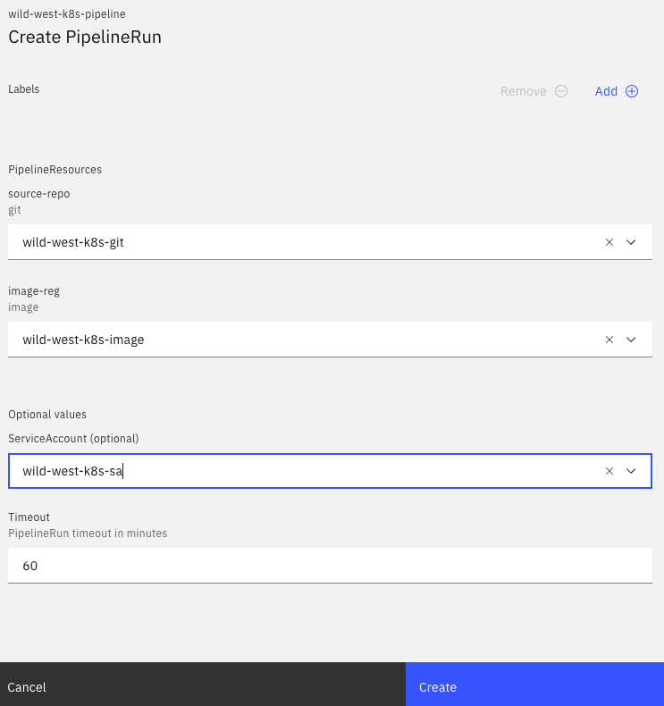
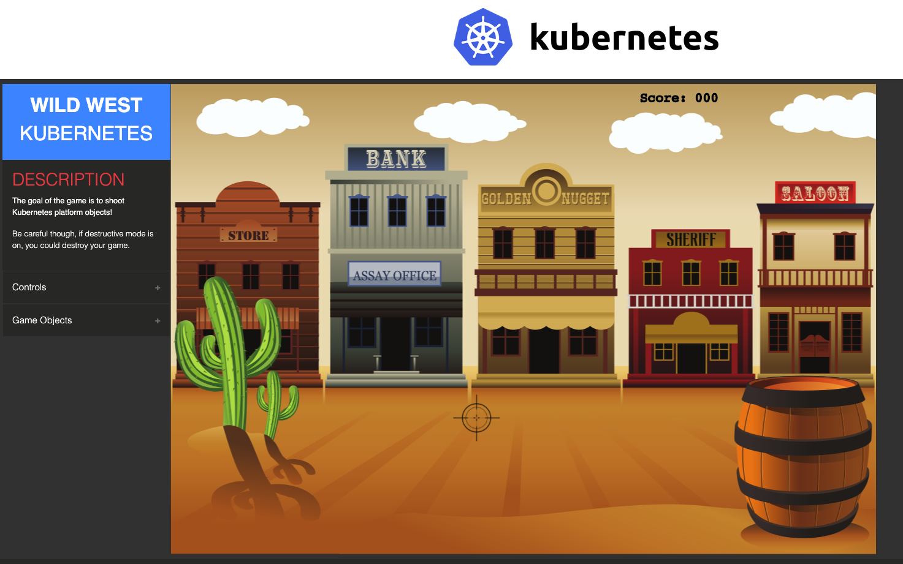

# Tekton Demo

This repository contains documentation and resources to deploy an application to Kubernetes using 
[Tekton](https://github.com/tektoncd/pipeline). The resources included will create a Tekton Pipeline 
that will run on Kubernetes, build a [sample application](https://github.com/danielhelfand/wild-west-kubernetes), 
push a container image for that application to an image registry, and deploy the built image as a container that will 
run on Kubernetes.

## Tekton 

Tekton is a continuous integration, continuous deployment (CI/CD) solution that represents aspects of CI/CD 
as Kubernetes [custom resource definitions (CRDs)](https://kubernetes.io/docs/concepts/extend-kubernetes/api-extension/custom-resources/). 
Using Tekton CRDs, developers can create CI/CD resources that are managed and orchestrated by Kubernetes.

## Prerequsites for this Tutorial

* A Kubernetes cluster version 1.15.0 or higher (Can be run locally using [Minikube](https://kubernetes.io/docs/tasks/tools/install-minikube/))
* The [`kubectl`](https://kubernetes.io/docs/tasks/tools/install-kubectl/) CLI for Kubernetes
* The [`tkn`](https://github.com/tektoncd/cli#installing-tkn) CLI for Tekton
* Create resources in the `default` namespace on Kubernetes

## Installing Tekton and the Tekton Dashboard

Tekton version `0.11.0-rc2` can be installed on a Kubernetes cluster using the following command:

```
kubectl apply --filename https://storage.googleapis.com/tekton-releases/pipeline/previous/v0.11.0-rc2/release.yaml
```

Optionally, the Tekton dashboard can be installed using the following command:

```
kubectl apply --filename https://github.com/tektoncd/dashboard/releases/download/v0.5.3/tekton-dashboard-release.yaml
```

## Setting Up an Image Registry for this Demo

This demo relies on having an image registry for pushing a container image. In the event you do not have access or 
do not want to push to an external registry, this demo also sets up a local image registry on the cluster where the demo 
is deployed to that can be used.

For an external Docker registry, the following command can be used to create a Kubernetes secret that will hold credentials 
for pushing to the registry:

```
kubectl create secret docker-registry regcred \
--docker-server=https://index.docker.io/v1/ \ 
--docker-username=<YOUR_USERNAME> \ 
--docker-password=<YOUR_PASSWORD> \ 
--docker-email=<YOUR_EMAIL> 
```

In the [`resources/image.yaml`](resources/image.yaml) file of this repository, replace `danielhelfand/wild-west-kubernetes:latest` 
with `YOUR_IMAGE_REGISTRY/wild-west-kubernetes:latest`.

For pushing to the local image registry, run the following command to get the `ClusterIP`:

```
kubectl get svc/registry 
```

In the [`resources/image.yaml`](resources/image.yaml) file of this repository, replace `danielhelfand/wild-west-kubernetes:latest` 
with `YOUR_CLUSTER_IP:5000/wild-west-kubernetes:latest`.

## Create Resources

Create the resources for this demo with the following command:

** If resources are local (REPLACE WITH LOCAL PATH):**
 
 `kubectl apply -k /path/to/local/repo/ -n default` 

 ** If resources are remote (REPLACE WITH REMOTE PATH):**

 `kubectl apply -k https://github.com/yourrepo -n default` 

## Starting The Pipeline

To create a PipelineRun that will execute this demo, `tkn` can be used by running the following command:

```
tkn pipeline start wild-west-k8s-pipeline -r source-repo=wild-west-k8s-git -r image-reg=wild-west-k8s-image -n default
```

Another option is to use the Tekton dashboard. To view the dashboard, run the following command and then go to 
`localhost:9097` in your browser:

```
kubectl --namespace tekton-pipelines port-forward svc/tekton-dashboard 9097:9097
```

Once the dashboard becomes available in your browser, click the **Pipelines** tab on the left side of your screen. 
Select `wild-west-k8s-pipeline` from the list of available `Pipelines`. On the page you are taken to, click the blue 
**Create** button on the right side of your screen. Fill in the prompts with the information below, and then click the 
**Create** button to start the PipelineRun:



## View Logs of PipelineRun

Using `tkn`, the logs of the PipelineRun you create will be available by running the following command:

```
tkn pr logs --last -f
```

Using the dashboard, make sure to be on the **PipelineRuns** tab. Click on the PipelineRun name that starts 
with `wild-west-k8s-pipeline`. The logs should be available after clicking on the name of the PipelineRun.

## View Deployed Application

Once the PipelineRun finishes successfully, the application can be viewed by running the following command:

```
kubectl port-forward svc/wildwest 8080:8080 -n default
```

Going to `localhost:8080` in a browser should show the following confirming the application deployed successfully: 


